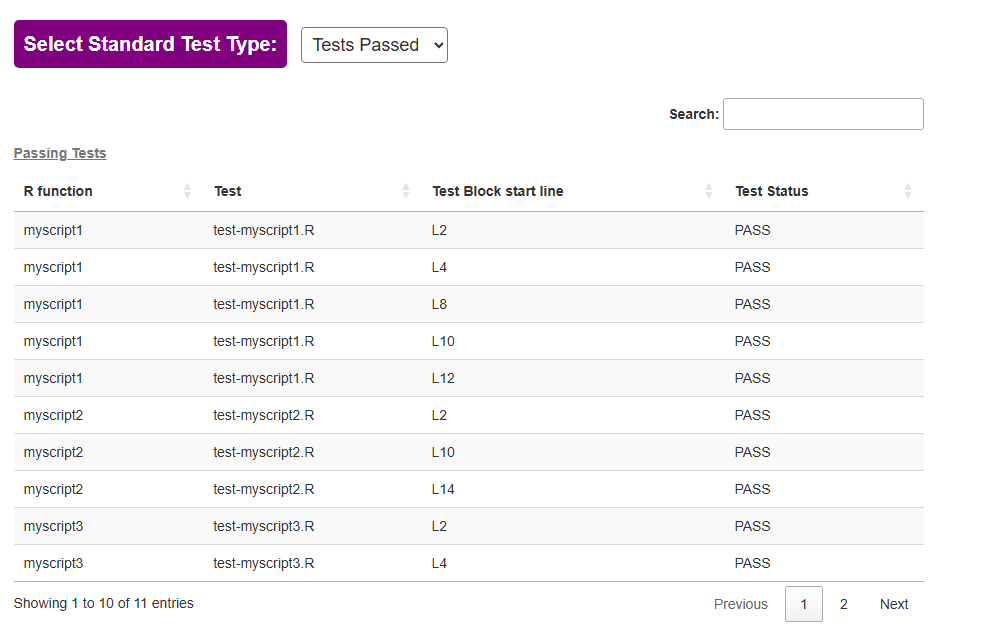
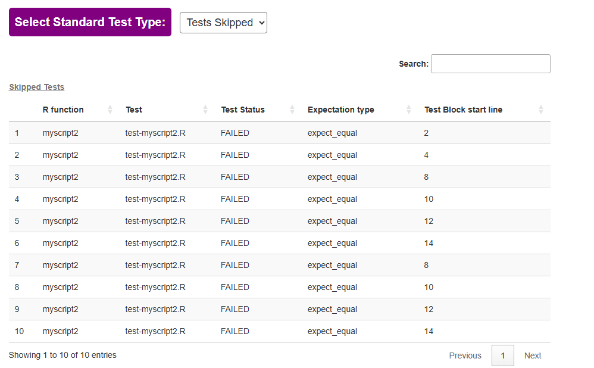
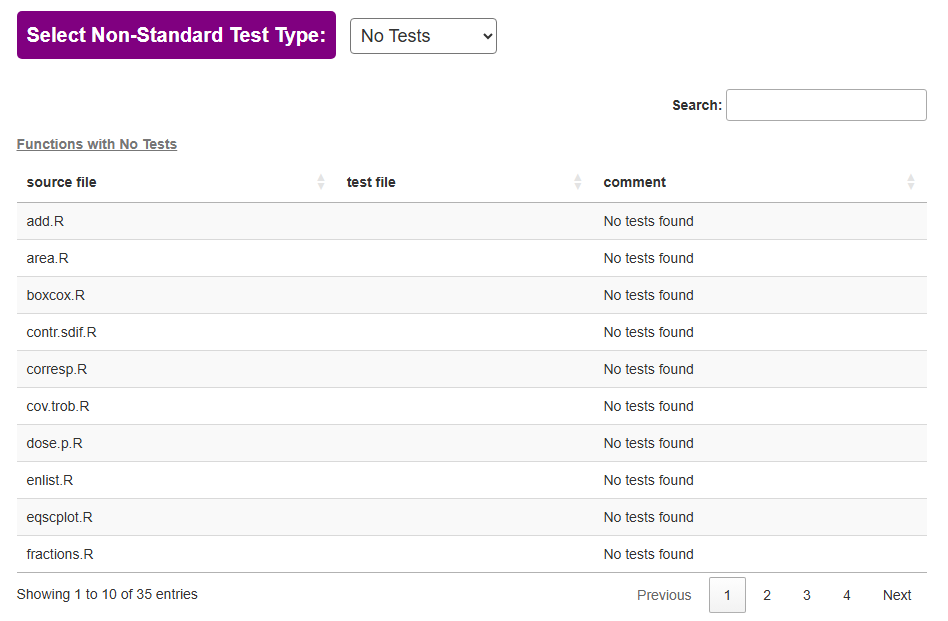
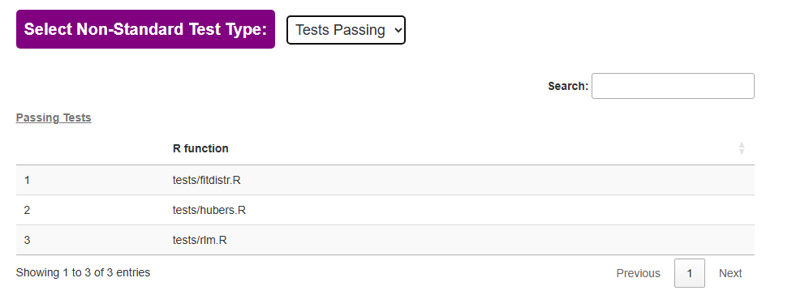
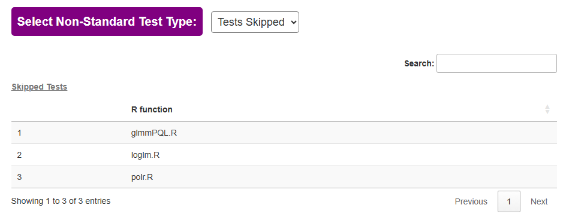

<!-- README.md is generated from README.Rmd. Please edit that file -->

# test.assessr <a></a>

<!-- badges: start -->


<!-- badges: end -->


# Overview

test.assessr helps in the assessment of a package's test reliability and validity. 

It calculates unit test coverage for packages with standard testing frameworks 
and non-standard testing frameworks, including Bioconductor packages.

# Description

This package executes the following tasks:

1.  upload the source package(`tar.gz` file)

2.  Unpack the `tar.gz` file

3.  Install the package locally

4.  Run code coverage


# Package Installation

## from [Github](https://github.com/Sanofi-Public/test.assessr)

-   Create a `Personal Access Token` (PAT) on `github`

    -   Log into your `github` account
    -   Go to the token settings URL using the [Token Settings URL](https://github.com/settings/tokens)
        -   (do not forget to add the SSH `Sanofi-Public` authorization)

-   Create a `.Renviron` file with your GITHUBTOKEN as:

<!-- -->

```         
# .Renviron
GITHUBTOKEN=dfdxxxxxxxxxxxxxxxxxxxxxxxxxxxxxxxxxxxfdf
```

-   restart R session
-   You can install the package with:

<!-- -->

```         
auth_token = Sys.getenv("GITHUBTOKEN")
devtools::install_github("Sanofi-Public/test.assessr", ref = "main", auth_token = auth_token)
```

# Usage

## Assessing your own package for test coverage

To assess your package's test coverage, do the following steps:

1 - save your package as a `tar.gz` file

-   This can be done in `RStudio` -\> `Build Tab` -\> `More` -\> `Build Source Package`

2 - Run the following code sample by loading or add path parameter to your `tar.gz` package source code

``` r
# for local tar.gz R package
dp <- (path/to/your/package)

test_package_coverage <- get_package_coverage(dp)

generate_test_report(test_package_coverage)

```


## `test.assessr` results


For a package with a standard testing framework such as `testthat` or `testit` 
or non-standard testing frameworks such as `BiocGenerics` and `RUnit`, 
`test_assessr` can provide data on which tests are passing and which tests are skipped.

The standard testing framework test report tells you which tests have passed: 



The report provides information on which test blocks have passed and the start 
line of each test block.

The standard testing framework test report tells you which tests have been skipped: 



The report provides information on which test blocks have passed, 
expectation type, and the start line of each test block.

The non-standard testing framework test report tells you which functions have no tests:



The report tells you which tests have passed: 



The test report tells you which tests have been skipped: 




# Current/Future directions

- to develop methods for checking the validity of test data
- to develop methods of checking mocks

# Acknowledgements

The project is inspired by the [`covrpage`](https://github.com/yonicd/covrpage) and [`mpn.scorecard`](https://github.com/metrumresearchgroup/mpn.scorecard) packages and draws on some of their ideas and functions.
